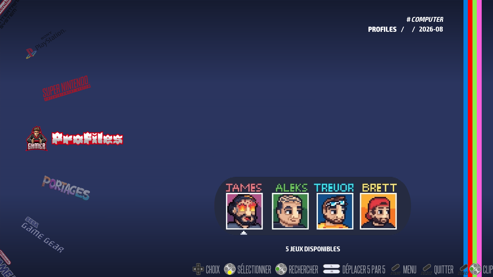
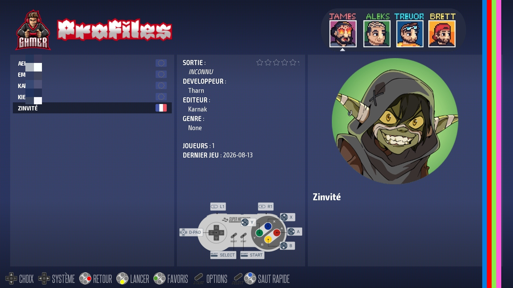

# recalbox-profiles  
Gestion avancée des profils de sauvegarde pour Recalbox, avec sélection automatique de profil, restauration intelligente des saves, synchronisation optimisée et configuration indépendante des RetroAchievements.

  
  

---

## 🎯 Objectif

Ce projet permet d’utiliser **plusieurs profils indépendants** dans Recalbox, chacun possédant :

- ses propres sauvegardes (`saves/`)  
- sa propre configuration RetroAchievements (RA)  
- son propre état de synchronisation  
- son propre compte RA (username/password)  
- son propre mode RA (normal / hardcore)

Le profil actif est sélectionné via un système custom dans EmulationStation.  
Les saves sont automatiquement restaurées au lancement d’un jeu et synchronisées à la fin.

---

## 📁 Structure attendue

```text
recalbox/
  share/
    profiles/
      current_profile.json
      profiles.log
      .sync_manifest.json

      Guest/
        RA_config.json
        megadrive/
          Aladdin.state

      Profil1/
        RA_config.json
        gba/
          Breath of Fire.srm

    saves/
      megadrive/
        Aladdin.state
      gba/
        Breath of Fire.srm

    roms/
      profiles/
        Guest.zip
        Profil1.zip
        gamelist.xml

    system/.emulationstation/
      systemlist.xml

    userscripts/
      swap_profile[rungame].py
      load_saves[rungame].py
      load_saves[gamelistbrowsing].py
      save_profile[endgame].py
```

---

## ⚙️ Configuration Recalbox

### 1. Création du fichier `systemlist.xml` local

```bash
cp -r /recalbox/share_init/system/.emulationstation/systemlist.xml \
      /recalbox/share/system/.emulationstation/
```

### 2. Ajout du système custom `profiles`

Dans `/recalbox/share/system/.emulationstation/systemlist.xml` :

```xml
  <!-- Profiles - system custom -->
  <system uuid="21b8873a-a93e-409c-ad0c-8bb6d682bef8" name="profiles" fullname="Profiles">
    <descriptor path="%ROOT%/profiles" theme="profiles" extensions=".zip .7z"/>
    <scraper screenscraper=""/>
    <properties type="console" pad="mandatory" keyboard="no" mouse="optional" lightgun="optional" releasedate="1990-11" retroachievements="1"/>
    <emulatorList>
      <emulator name="libretro">
        <core name="snes9x" priority="1" extensions=".zip! .7z!" />
      </emulator>
    </emulatorList>
  </system>
  <!-- Profiles - system custom -->
```

**Notes :**

- L’UUID doit être **unique**.  
- Le `path` doit pointer vers `%ROOT%/profiles`.  
- Le thème doit contenir un fichier `profiles.xml`.

---

## 🎮 ROMs de sélection de profil

Dans `recalbox/share/roms/profiles/` :

- `Guest.zip`  
- `Profil1.zip`  
- `gamelist.xml`

Les `.zip` sont **vides** : ils servent uniquement de déclencheurs pour changer de profil.

> Pour éviter les messages d’erreur RetroArch, utiliser une ROM SNES valide dans le zip.

---

## 🎨 Intégration dans le thème Recalbox Next

### Option A — Copier le thème dans `share/themes`

1. Copier `recalbox-next` depuis :  
   `/recalbox/share_init/system/.emulationstation/themes/`
2. Le renommer (ex. `recalbox-next-profiles`)
3. Ajouter `profiles.xml` dans `_systems/`
4. Modifier `theme.xml` pour inclure le système `profiles`

### Option B — Modifier le thème d’origine

Nécessite un accès en écriture à la partition système.

---

## 🧠 Fonctionnement des scripts

### `swap_profile[rungame].py`  
**Événement : `rungame`**

- Détecte le lancement d’une ROM du système `profiles`
- Extrait le nom du profil
- Met à jour `current_profile.json`
- Termine RetroArch pour revenir à EmulationStation
- Log l’événement dans `profiles.log`
- Met à jour la gamelist (`region` ou images)
- **Applique automatiquement la configuration RetroAchievements du profil dans `recalbox.conf`**

---

### `load_saves[rungame].py`  
**Événement : `rungame`**

- Lit le profil actif  
- Copie les saves du profil vers `share/saves/`  
- Ignore le système `profiles`  
- Log le début de jeu  

---

### `load_saves[gamelistbrowsing].py`  
**Événement : `gamelistbrowsing`**

- Même logique que `load_saves[rungame].py`  
- Utilisé pour la prévisualisation des save states  

---

### `save_profile[endgame].py`  
**Événement : `endgame`**

- Lit le profil actif  
- Détecte les saves modifiées  
- Synchronise uniquement les fichiers modifiés  
- Met à jour `.sync_manifest.json`  
- Log la fin de jeu  

---

## 🏆 Gestion automatique des RetroAchievements (RA)

Chaque profil peut contenir un fichier :

```
/recalbox/share/profiles/<profil>/RA_config.json
```

Ce fichier définit les paramètres RA propres au profil :

- `0` = désactivé  
- `1` = activé  

```json
{
    "global.retroachievements=": "1",
    "global.retroachievements.hardcore=": "0",
    "global.retroachievements.username=": "username_ra",
    "global.retroachievements.password=": "password_ra"
}
```

### ✔ Application automatique dans Recalbox

Lorsqu’un profil est sélectionné :

- Le script lit `RA_config.json`
- Les valeurs sont appliquées automatiquement dans :

```
/recalbox/share/system/recalbox.conf
```

Les lignes suivantes sont mises à jour :

```
global.retroachievements=
global.retroachievements.hardcore=
global.retroachievements.username=
global.retroachievements.password=
```

### ✔ Avantages

- Comptes RA indépendants par profil  
- Mode Hardcore configurable par profil  
- Aucun besoin de modifier `recalbox.conf` manuellement  
- `RA_config.json` reste la source unique des paramètres RA  

---

## 📌 Chemins clés

- Profil actif : `share/profiles/current_profile.json`  
- Log : `share/profiles/profiles.log`  
- Manifest : `share/profiles/.sync_manifest.json`  
- ROMs de sélection : `share/roms/profiles/`  
- Gamelist du système : `share/roms/profiles/gamelist.xml`  
- Config Recalbox : `share/system/recalbox.conf`  

---

## 📥 Installation

1. Copier les scripts dans `share/userscripts/`  
2. Ajouter le système `profiles` dans `systemlist.xml`  
3. Créer les dossiers de profils dans `share/profiles/`  
4. Créer les ROMs de sélection dans `share/roms/profiles/`  
5. Ajouter `profiles.xml` dans le thème  

---

## 🕹️ Utilisation

### Changer de profil  
- Lancer `Guest.zip` ou `Profil1.zip`  
- RetroArch se ferme automatiquement  
- EmulationStation recharge le profil actif  

### Lancer un jeu  
- Les saves du profil actif sont restaurées automatiquement  

### Fin d’un jeu  
- Les saves modifiées sont synchronisées dans le profil actif  

---

## 📝 Exemple de log

```text
[system] | [2026-08-11 12:00:00] | profiles | ProfileSwap | Guest
[Guest]  | [2026-08-11 12:05:00] | snes     | GameStart   | Super Mario World
[Guest]  | [2026-08-11 12:45:00] | snes     | GameEnd     | Super Mario World
```

---

## 🔧 Scripts manuels (optionnel)

Dans `share/userscripts/manual/` :

- `Guest(sync).py` / `Profil1(sync).py`  
  - Charger manuellement un profil  
  - Initialiser un profil  
  - Dépannage  

- `Save_profile(sync).py`  
  - Sauvegarder manuellement les saves actuelles  
  - Forcer une synchronisation complète  

---

## 🛡️ Remarques

- Les scripts utilisent `/recalbox/share/` et `/tmp/es_state.inf`  
- Le système `profiles` doit être ignoré dans les scripts de save/load  
- `current_profile.json` doit exister et être valide  
- Vérifier les permissions d’écriture sur `share/profiles/` et `share/saves/`  
